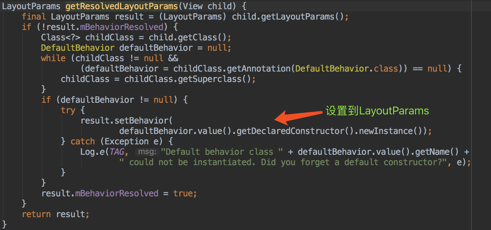
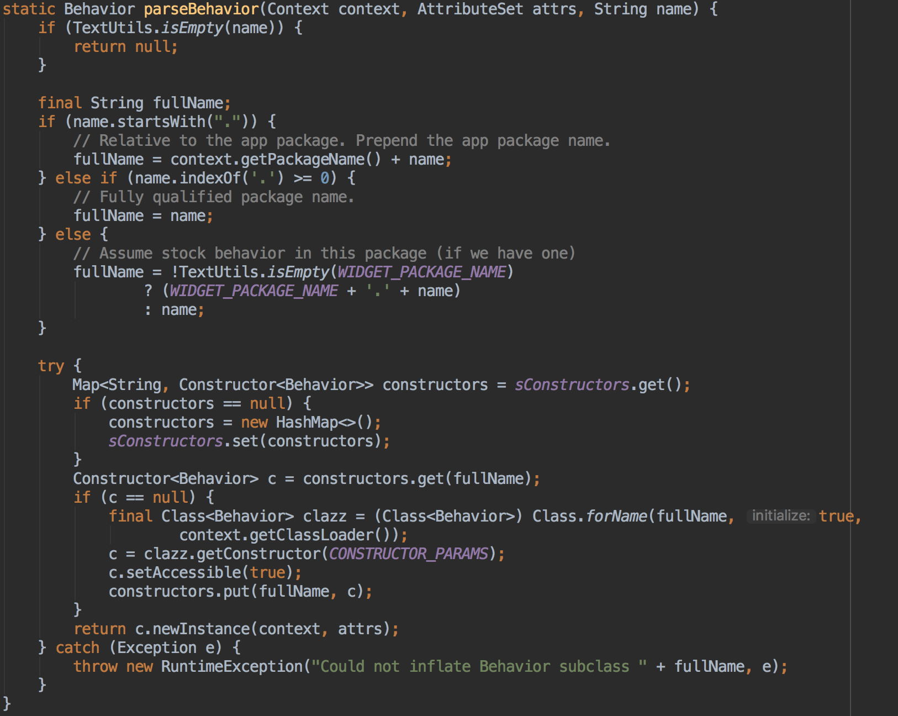

# CoordinatorLayoutDemo

## 原理介绍

CoordinatorLayout的出现主要有2个作用：
1. 用作顶层布局，作为其他View控件的父容器
2. 用作和子View产生特定交互功能，这个主要通过Behavior来实现

CoordinatorLayout继承自ViewGroup，同时实现了NestedScrollingParent接口。

### Behavior

协调CoordinatorLayout和它下面的各child Views的交互行为。

Behavior只有是CoordinatorLayout的**直接子View**才能有作用，可以对任何的view添加behavior。

#### 原理分析

Behavior有2种构造函数，分别代表了2种不同的绑定到子views的方式：

```java
// 通过实例化的方式构造
public Behavior() {
}

// 通过layout布局的信息的方式构造
public Behavior(Context context, AttributeSet attrs){
}
```

> 构造方法

系统提供的控件都是采用这种方式。采用注解+反射的形式。

注解的定义：

```java
@Retention(RetentionPolicy.RUNTIME)
public @interface DefaultBehavior {
Class<? extends Behavior> value();
}
```

在View的onMeasure()里完成注解的解析：



> layout方式

在xml里标明实现的Behavior类`app:layout_behavior=XXX`，这里也是通过反射，触发的时机是在LayoutParams实例化完成的时候。



#### 2种协调方式

> depentent方式

主要是触发如下的回调：

```java
// 决定是否产生依赖行为
// 就是决定child和dependency是否有依赖关系，这个方法会在layout的时候触发
// 如果是，则parent总是会首先布局dependency，然后才布局child，不管他们的布局顺序；当dependency位置变化时，调用onDependentViewChanged()
public boolean layoutDependsOn(CoordinatorLayout parent, V child, View dependency) {
return false;
}

// 当dependency view的size或position发生了变化将会触发，将相应的更新child view
public boolean onDependentViewChanged(CoordinatorLayout parent, V child, View dependency) {
return false;
}

// 当dependency view被删除，相应的对child view做处理
public void onDependentViewRemoved(CoordinatorLayout parent, V child, View dependency) {
}
```

> nested方式

nested方式是CoordinatorLayout内部包含了一个实现了NestedScrollingChild接口的滚动视图控件，child view会随着该控件的滚动而发生变化。

它涉及到如下的几个方法：

```java
onStartNestedScroll(View child, View target, int nestedScrollAxes)
onNestedPreScroll(View target, int dx, int dy, int[] consumed)
onNestedPreFling(View target, float velocityX, float velocityY)
onNestedScroll(View target, int dxConsumed, int dyConsumed, int dxUnconsumed, int dyUnconsumed)
onNestedFling(View target, float velocityX, float velocityY, boolean consumed)
onStopNestedScroll(View target)
```

这写方法跟NestScrollView里的方法匹配上，onStartNestedScroll返回true才能使自定义的Behavior接受滑动。

### 自定义Behavior

自定义Behavior只要继承CoodinatorLayout.Behavior。

> 事件拦截

* onInterceptTouchEvent
* onTouchEvent

触摸事件总是先交给 CoodinatorLayout，它会询问所有子 View 的 Behavior 是否需要拦截事件。

**如果要自己成为那个主动移动的额控件，则可以实现。**

> 嵌套滚动Nested

Nested方式

> child 和 dependency

dependency
